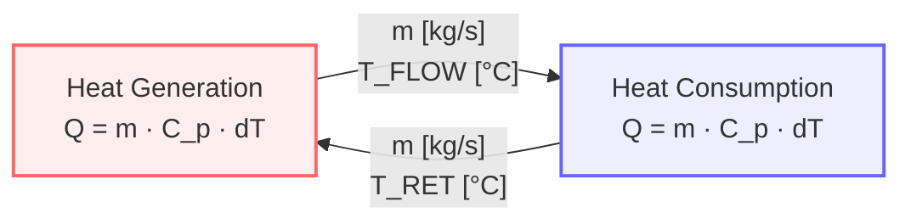

This post will explain the heat transfer equation $Q = m \cdot C_p \cdot dT$ and how to apply it to optimize the capital and operating cost of hot water loops.

## The Heat Transfer Equation

**A simple hot water loop**

This equation shows how to calculate heat transfer in our hot water loop:

$$Q \text{ [kW]} = m \text{ [kg/s]} \cdot C_p \text{ [kJ/kg/°C]} \cdot dT \text{ [°C]}$$

- **Heat transfer rate** $Q$ [kW]: amount of thermal energy transferred per unit time.
- **Mass flow rate** $m$ [kg/s]: measurement of the amount of water flowing around the hot water loop.
- **Specific heat capacity** $C_p$ [kJ/kg/°C]: thermodynamic property specific of the fluid used to transfer heat. We could manipulate the specific heat capacity only by changing the fluid used in the loop.
- **Temperature difference** $dT$ [°C]: difference in temperature before and after heat transfer.

## Application: Sizing Hot Water Loops

**Hot water loops are commonly used to transfer heat in district heating networks and on industrial sites**. The capital and operating costs of many hot water loops are higher than they should be.

Optimization of a hot water loop requires correctly setting the flow rate and temperature.  **We could use a high mass flow rate and low temperature difference.  We could also use a low mass flow rate with a high temperature difference**.

Water is a good fluid choice for cost and safety considerations.  The specific heat capacity of water does vary with temperature but for the scope of a hot water loop it is essentially constant.

**A low mass flow with high temperature difference is optimal and will reduce our capital & operating costs**. A low mass flow rate minimizes the amount of electricity required to pump water around the loop.

A high temperature difference leads to:

- **Increased heat capacity**: Pipe size limits the capacity of the loop by limiting the maximum flow rate. More heat can be transferred at the maximum flow rate by using a larger temperature difference
- **Maximized heat recovery**: From CHP heat sources such as jacket water or exhaust
- **Maximized electric output**: From steam turbine based systems by allowing a lower condenser pressure

**The capital cost benefit comes from being able to either transfer more heat for the same amount of investment or to install smaller diameter pipework**.

The operating cost benefit arises from reduced pump electricity consumption and increased CHP system efficiency.

## Summary

Heat transfer is a fundamental energy engineering operation.

The heat transfer equation $Q = m \cdot C_p \cdot dT$ relates the heat transfer rate to the mass flow rate, specific heat capacity and temperature difference.

It is fundamental to optimizing hot water loop systems:

- **Low mass flow, high temperature difference** minimizes both capital and operating costs
- **Reduced pumping costs** from lower flow rates
- **Smaller pipe diameters** possible with higher temperature differences
- **Enhanced heat recovery** from CHP systems
- **Increased system capacity** within existing infrastructure constraints

Thanks for reading!
