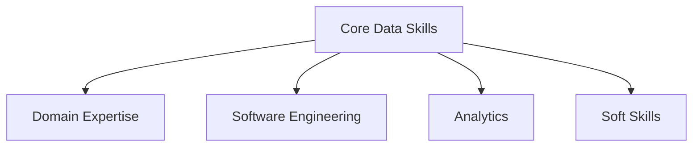
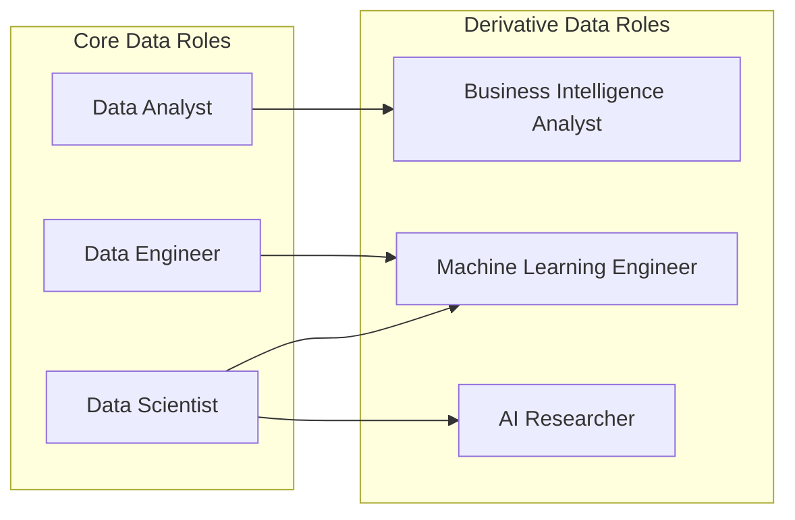

## What is a Data Professional?

**A data professional provides business value from data**.

As technology progresses, businesses generate and capture more and more data.

Alongside the increased volume, variety and velocity of data, professions have developed to provide value from data.

What data professionals call themselves changes between companies and over time:

- a data engineer in one company is called a business intelligence analyst in another,
- the big data technologist of the 2000's would now call themselves a data scientist.

## Where Do Data Professionals Come From?

As data professions continue to evolve, the academic qualifications are as well.

Historically, no university offered data science degrees or masters programs.  **Currently many data professionals do not have formal qualifications as a data professional**.

Instead, many data professionals of today have education in other fields. Often they come from STEM backgrounds.  Many more come from other backgrounds, such as commerce or the arts.

Today this is changing, with many universities offering data science programs.

## Who Can Be A Data Professional?

**We believe that anyone can start or transition into a data career**.

The tools (such as Python) and knowledge (such as how backpropagation works) are all available online or through education - it's only your ability to dedicate time and energy that limits you.

Some backgrounds (such as a math or programming heavy bachelors degree) will have an easier time picking up the skills and mindsets needed in modern data work.

**While a STEM background offers an advantage, we believe that if you want it, anyone can develop the skills to deliver value as a data professional**.

## Core Data Roles

**There are three core data roles**:

1. **data analyst** - summarizes the past,
2. **data scientist** - predicts the future,
3. **data engineer** - provides access to data.

These three roles are the foundation of modern data work. Deciding which role to focus on depends on your experience, skillset, goals and personality.

**These roles are complementary, and it is not uncommon for professionals to develop skills across multiple roles over their career**.

```goat
               Core Data Roles
                     |
  +------------------+---------------+
  |                  |               |
Data Analyst    Data Engineer    Data Scientist
```

### Data Analyst

**A data analyst summarizes historical data**.

These summaries of data are used to inform business decisions.

A data analyst uses statistics, a programming language like Python and SQL to extract insight from data. Communication is a key skill for the data analyst, required to communicate their findings to decision-makers.

A data analyst commonly requires SQL and Python skills. A data analyst will be expected to be able to work with tabular data, and is unlikely to require any machine learning knowledge.

### Data Scientist

**A data scientist predicts unseen data**.

Data science is a combination of predictive analytics with machine learning and experimentation design.

Data science requires a deep understanding of mathematics including calculus, linear algebra, statistics and probability. A data scientist will require good Python programming skills, and perhaps will benefit from SQL skills if their role involves querying existing SQL databases.

A data scientist could be expected to work with tabular data, images and text.

### Data Engineer

**A data engineer provides access to data**.

A data engineer is responsible for the infrastructure that stores, processes, and transforms data. They develop and maintain the systems that enable data analysts and scientists to do their jobs.

A data engineer requires SQL and Python skills, and will be expected to be comfortable working with cloud infrastructure.


## Four Competencies of a Data Professional

**There are four competencies that make up a data professional**:

1. domain expertise,
2. software engineering,
3. analytics,
4. soft skills.



### Domain Expertise

**One advantage that someone from any background can bring into a data career is domain knowledge and expertise**.

If you have worked in a domain like energy, fashion or law, the understanding you have gives you an important advantage as a data professional.

### Software Engineering

Most data professionals use code in their work.

**Code offers a number of advantages over other analytical tools like Excel**:

- it can be automated and repeated,
- it can be tested,
- it can be deployed at scale.

While not every data professional needs to be able to work as a software engineer, software engineering skills are important for data professionals.

The table below provides a general guideline of the importance of each skill for each role on a scale from 1 to 3, with 3 being the highest.

|                | Data Scientist | Data Analyst | Data Engineer |
| -------------- | :------------: | :----------: | :-----------: |
| Programming    |       2        |      1       |       2       |
| Git            |       2        |      1       |       3       |
| Shell          |       2        |      1       |       3       |
| SQL            |       2        |      3       |       3       |
| Cloud          |       2        |      1       |       3       |
| Databases      |       1        |      3       |       3       |
| Pipelines      |       1        |      1       |       3       |
| CI/CD          |       2        |      1       |       3       |

### Analytics

**Mathematical understanding is core to working as a data professional**.

This includes understanding things like:

- statistics,
- probability,
- linear algebra,
- machine learning.

Which specific areas of analytics are important depends on the role you are working in.

Some data roles (such as data science) require a deep understanding of machine learning, while others (such as a data engineer) may not need any machine learning at all.

The table below provides a general guideline of the importance of each skill for each role on a scale from 1 to 3, with 3 being the highest.

| Skill                | Data Scientist | Data Analyst | Data Engineer |
|----------------------|----------------|--------------|---------------|
| Probability          | 3              | 2            | 1             |
| Linear Algebra       | 3              | 1            | 1             |
| Statistics           | 3              | 2            | 2             |
| Data Visualization   | 2              | 3            | 1             |
| Machine Learning     | 3              | 1            | 1             |
| Data Interpretation  | 2              | 3            | 1             |
| Reporting            | 2              | 3            | 2             |
| Experiment Design    | 3              | 2            | 1             |

### Soft Skills

Alongside the hard skills discussed above, a data professional also needs soft skills such as:

- communication,
- collaboration,
- mentoring,
- time management,
- curiosity,
- attention to detail.

The table below provides a general guideline of the importance of each skill for each role on a scale from 1 to 3, with 3 being the highest.

| Skill                | Data Scientist | Data Analyst | Data Engineer |
|----------------------|----------------|--------------|---------------|
| Communication        | 2              | 3            | 1             |
| Collaboration        | 2              | 2            | 3             |
| Time Management      | 3              | 3            | 3             |
| Curiosity            | 3              | 3            | 1             |
| Attention to Detail  | 3              | 3            | 3             |


## Derivative Data Roles

**In addition to our three foundational data roles, there are more derivative data roles**.



These derivative roles are built on top of the core data roles, and are often composites of the core data roles.

### Machine Learning Engineer

**A machine learning engineer is responsible for developing and deploying machine learning models**.

They work closely with data scientists to design and build machine learning models, and then work to deploy those models into production. The discipline of deploying and managing machine learning in production is known as MLOps (for Machine Learning Operations).

A machine learning engineer will require good programming skills, a deep understanding of machine learning and the ability to work with cloud infrastructure.

### Business Intelligence Analyst

**A business intelligence analyst works to understand the needs of a business and its stakeholders, and to identify opportunities for improvement**.

They use data analysis and modelling to identify trends, patterns and insights that can inform business decisions. They work closely with stakeholders to understand their needs and to develop solutions that address those needs.

They may also work on identifying new opportunities for revenue and growth, and on developing and implementing strategies to achieve those goals.

### AI Researcher

**The AI (Artificial Intelligence) researcher is responsible for advancing the field of artificial intelligence through research and development**.

They work on developing new algorithms and models for machine learning, natural language processing, computer vision, robotics, and other areas of AI.

They may also work on developing new applications for AI technology, such as autonomous vehicles, virtual assistants, and medical diagnosis tools.

AI researchers require a deep understanding of mathematics, computer science, and statistics, as well as experience in programming and data analysis.

## Choosing a Data Focus

**You should always have a clear idea about which data role best aligns with your current work, your goals and your future work**.

### Why Choose a Data Focus?

A data focus is important because it allows you to focus your development on the set of skills and technologies that matter.

The modern data world is vast, with many different areas to focus in. Understanding what you are focused on, either as an employee working as a data professional or someone working towards their first data role, is useful.

### Decide What You Want

It's important to reflect on what you want from your next role:

- What size or stage of company?
- Remote, in-person or hybrid?
- Location?
- Technology stack?
- Product domain?
- Mission (social good vs. high frequency trading)?
- Culture (collaboration vs. independence, wide vs. narrow focus, familiarity between coworkers)?

Another useful question to ask is "In my career thus far, when have I felt most happy and fulfilled? During those periods, what was my job/company like?"

A data focus allows you to focus your development on the set of skills and technologies that matter most to you in the short to medium term.

Understanding what you are focused on will help you excel as a data professional.

### Changing Your Data Focus

While at any one point it's important to know which data career best aligns with your current work, it's also important to know that this can change over time.

There is a lot of overlap between the competencies and skills in each of the three core data roles.

**If you find yourself more attracted or useful in a different data role, change your focus!**
