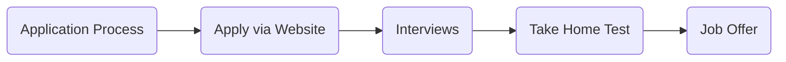

## Four Steps to Find a Data Job

There are four steps to finding a data job:

1. [choose the data career you want](https://www.datasciencesouth.com/lessons/choose-a-data-career),
2. summarize common job requirements across many job advertisements for that role,
3. create stories that demonstrate your competence in requirements,
4. use these stories in your career materials.
 
## Demonstrating Competence

Getting a job requires demonstrating competence - showing you can do the job.

Demonstrating competence means explaining why you’re a good fit - communicating the value you would bring to the company in the short and long term.  This is an opportunity to show understanding of the company goals.

## The Importance of Stories

Competence is best demonstrated through stories - concrete examples that show your capabilities.

Compare the difference between two approaches to communicate skills.

The first lists the skills:

```
Skills:
- data analysis,
- Python.
```

The second tells a story:

```
Used Python to analyze data.
```

These feel different - the story implies action, the list bores.  Stories also feel more real & convincing - it's harder to lie when you are painting a picture.

Action focused stories highlight your contribution to tangible successes, such as *developed a machine learning model that reduced churn 4%* or *improved data quality leading to saving 4 hours of developer time per week*. 

Use strong action verbs to describe your experience - take credit and responsibility for your work (while remaining honest). Be specific - include numbers in your accomplishments whenever possible.

Show evidence of your successes - use specific and relevant examples of your achievements to demonstrate you have what the employer is looking for.  

Stories can be reused - on your CV and in an interview.  One story can also communicate multiple skills or competencies - such as showing teamwork and leadership.

To summarize, stories are important because:

- stories can be action focused - an engaging way to demonstrate competence,
- stories can show specific & quantified examples of your success,
- stories can be re-used - one story can demonstrate many competencies,
- stories are believable - it's harder to lie in a story than a list.


## Staying Positive

Finding a job is a numbers game - it is high variance.  Luck will play a big factor in how your job search goes.

See each iteration of CV fine tuning or interview as practice - it may take 50 applications to get one offer.

## Application Process



Throughout the application process, it's important to demonstrate interest and engagement in the company and their problems.  You should always respond promptly throughout the application process.

Three main parties could be involved - a recruiter, a hiring manager and potential co-workers.

The recruiter is responsible for finding candidates and passing them onto the hiring manager.

The hiring manager is responsible for determining whether a candidate gets a role.

Potential co-workers will be involved at different points in the process, often during interviews or doing technical assessments.

### Find and Apply for Jobs

The process starts with the candidate applying via a company website, which can be done by submitting a CV, cover letter and other required application materials.  Always prefer applying via the company website over an aggregator like LinkedIn.

#### Where to find jobs?

One of the best places to find a job is directly from a company - by paying attention to their job listings on their website or social media.

If you know someone, you can be referred or introduced.  These direct contact channels are difficult to find, and valuable if you have them.

More common is to find job listings on an aggregated platform such as LinkedIn, Glassdoor or Kaggle Jobs.  Most of these sites allow you to setup job alerts based on keywords or to follow companies you like.

Even when you find a job on an aggregation site, always try to apply through the company website - it is very easy to spam applications on LinkedIn!

Jobs can also posted on community forums such as Slack or Discord channels - here are a few of our favourites are the [Climate Change AI](https://www.climatechange.ai/) and [DataTalks.Club](https://datatalks.club/).

#### What jobs should I apply for?

Apply for jobs that resemble your skillset and your data focus (such as data engineering) - avoid applying to jobs where the core requirements are clearly unrelated your primary skill set.

Go for jobs one step above (and at!) your level - many companies advertise for a senior data scientist, but will hire a data scientist.

#### Collect job descriptions

Job description has two parts - what you'll do and what the company is looking for (experience & education).

Qualifications (like experience or education) are always negotiable and should never deter you from applying if you think you’re almost there but missing a few requirements.

Why you are a good fit - ask yourself the following questions:

- what is the company’s mission?
- what problem are they trying to solve?
- what’s the product?
- what’s unique about this company compared to its competitors?
- what are some policies or values that the company has that they feature on their homepage?
- describe any of the organization’s community engagement projects or employee development programs.
- how does the company make money?


### Interviews

After submitting the application, the candidate will typically move on to the interview stage, where they will have the opportunity to speak with the hiring manager or a member of the HR team.

During the interview stage, the candidate will have the opportunity to provide more information about their qualifications and experience, and to ask any questions they may have about the job or the company.

Some of the basics for interviews are:

- make sure you turn up on time - call if you are running late,
- don't curse or swear,
- for virtual interviews, make sure you microphone and camera setup is working.  each platform (Zoom, Google Meets etc) will require different work to get working (such as permissions to access the camera etc) - ideally practice with the platform you will use.

Don't be too modest - avoid one word answers, take the time to expand on your skills, abilities, achievements and goals.

#### Questions You Might Be Asked

Always answer questions - if you need to take a minute to answer with confidence, ask for a moment.

You should be able to answer questions about:

- what the company does,
- what their mission is,
- who their customers are,
- challenges in their industry,
- how they make money.

Types of questions you may be asked include:

- so we have this problem / case studies - told about a project the interviewer is currently working on, and then they would pick my brain on how to solve this,
- system design questions - `how would you design this feature`.

##### Competency Questions

Behavioral or competency questions are questions of the form `Tell me about a time you did X` - `X` being either a soft or hard skill.

Tell me about a time you had to solve a complex problem. What steps did you take?

Describe a situation where you had to meet a tight deadline. How did you manage it?

Can you share an experience where you led a team to achieve a specific goal?

How have you handled a difficult team member in the past?

Describe a project where you had to use your analytical skills.

Can you provide an example of a successful customer interaction you've had?

Tell me about a time you had to adapt to a significant change at work.

Have you ever had to manage conflicting priorities? How did you handle it?

What's an example of a risk you've taken in your career and the outcome?

Describe a time when you had to convince a team to adopt a new technology.

How do you manage stress in high-pressure situations?

Tell me about a time when you had to work with limited resources.

Can you describe a situation where you had to resolve a conflict between team members?

Tell me about an instance where you had to use your negotiation skills.

How do you ensure quality in your work when faced with tight deadlines?

Describe a time you had to learn a new skill to complete a task.

Have you ever implemented a cost-saving measure? What was it and what was the result?

How do you handle receiving constructive criticism?

Can you share an example where you had to go above and beyond in your job?

Tell me about a time when you had to collaborate with departments outside of your own. How did you manage communication?

Tell me about a time you changed your mind?


#### Questions You Can Ask

Also make sure to always ask questions - be interested to learn more.

- what is your turnover rate?
- how is technical work planned and managed - sprint length, retros etc?
- what is your current technical stack?
- what are you current technical problems / challenges?
- retention rate, career advancement, potential for scale?
- what is a senior role (data scientist) and how do I get there?
- how closely do the dev team work with business stakeholders/customers?
- what’s your deployment process like?
- how often do you release to production?
- what’s your testing strategy?
- training budget?
- size of team, how long have they been there (to see if team is new / churning)
- data engineering support?
- laptops?
- cloud?
- do you do deep learning?
- can devs use any computer / operating system?
- what does your promotion process look like?
- what kind of feedback do you get from your manager?
- what does a typical conversation with your product manager look like?
- what topics are covered during your 1:1s with your manager?
- what does success look like for this role?
- what does success look like for your team?
- how is success measured?
- what went well / badly in the past for this role?
- what are your current challenges in your role?
- how is the commitment to sustainability balanced with financial success?

For startups you can ask questions about how much funding do you have or when they next need to raise money.

For large corporations, ask if you are able to choose what operating system runs on your laptop.


### In Person Programming Tests

Part of the application process may involve live, in person programming.

A good way to think about these is:

- start with a simple solution,
- then more advanced,
- talk about time and memory complexity,
- write or mention test cases,
- then an even harder version.

### Take Home Tests

After the interview, the company may ask the candidate to take a take-home test as an additional assessment of their skills and qualifications. This could be a case study, a sample project or a test that is relevant to the position.

Some tips for take home tests:

- ask upfront for expectations (time input) and future feedback,
- ask questions and state assumptions,
- make your code readable,
- write Tests and Comments,
- summarize your thought process in under 500 words!

Sample ML take home pipeline:

- data cleaning, Impute missing values
- minimal feature selection
- create a simple test train split or use cross validation if enough time,
- put in a baseline dummy model,
- train a random forest classifier or regressor.

### Offer

Once the assessment is completed, the company will make a job offer to the candidate if they are deemed to be a good fit for the position.

## Why Learn about Career Materials?

## What are Career Materials?

**Career materials are content that you to create & maintain to succeed in your career**.  This content will be shared with others, and can represent you both privately and publicly.

**All your career materials should be cleanly and consistently formatted, without spelling or grammatical errors**.

## Looking for Roles

Favour a concentrated, deep approach over a wide, shallow net.  You only need to find one job!

**In the best case, your career materials will reflect the job requirements of your desired role**.  

## CV 

**A CV (Curriculum Vitae) summarizes your education, work experience, and skills**. 

It's likely that everyone involved in your job application process will look at your CV - it's the most important career document.

You should share your CV as a PDF document, and it should be one or two pages long.

### CV Length is Important

Space on your CV is valuable - it represents time that someone needs to spend understanding your CV.  The more you can focus on important, relevant skills, the better your CV will be.

### Structuring Your CV

#### Header

The first part of your CV should be a header that contains:

- your name,
- your location (usually just a city),
- links to your LinkedIn, Github and email,

Whether you need to include a picture or not depends on the market - most likely you don't need a picture on your CV.

#### Summary

**Your CV should start with a one to three sentence summary**.

Your summary can focus on your experience, your skills or your professional mission.

```text
fn:summary
Data {analyst | scientist | engineer} with {n} years of experience in {industry}.
Proven ability to {skill}. 
Passionate about {industry | topic}.
```

#### Work Experience

**Your work experience should be based on stories** - action focused, using phrases like:

- responsible for,
- lead team,
- introduced ideas, concepts or new ways of working,
- built, developed or constructed,
- made or saved money.

```text
fn:experience
{job title} at {company} from {date} to {date}
- {action focused achievement},
- {action focused achievement}.
```

#### Education

**Your education section lists relevant education at universities or bootcamps**. 

You can also consider adding online courses or certifications.

How much you include here depends on your level.  If you are early on in your career, you might include a relevant list of courses for your degrees.  

For those with a decade of experience, they may only include the degree title, preferring to use the space on their experience.

```text
fn:experience
{degree} at {university} from {date} to {date}
- {action focused achievement},
- {action focused achievement}.
```

#### Skills & Projects

**Skills and projects are optional sections**.

Skills should be tailored the position, and match what they ask for in the job advertisement.

While a list of skills may be good for word recognition, it is too easy to lie on skill lists. So much that they are often ignored.  Stories however, are much harder to fabricate.  Be specific!

If you do include a skill on your CV, be prepared to be asked questions about in during interviews.

## Cover Letter

**A cover letter provides a more detailed explanation of why you are a good fit for the job**. 

A cover letter is a one page personalised note to support your job application. Like your CV it should be targeted, tailored and personalised.  It should be formatted consistently with your CV.  Your cover letter should be one page - between five to eight paragraphs. Ideally it is addressed to specific person.

**The goal of a cover letter is expand on your CV - not to repeat it**. A cover letter lets you expand on things like your current availability, a story of your recent successes or examples of benefit you can bring to a role.

A example cover letter structure:

```text
fn:cover-letter
To {whom it may concern | $NAME},

I am writing to apply for the {POSITION} role at {COMPANY}, as advertised on {WHEREYOUFOUNDIT}

First paragraph:
- be clear about which position you are applying for and how you found it,
- outline why you are applying,
- your main experience.

Middle section (second, third and/or fourth paragraphs):
- how your skills and experience match the job,
- what bring to the role (show skill alignment), suitable skills
- key achievements, background on what makes you relevant,
- why you want to work there,
- each paragraph can be one story.

Ending - one of:
- I look forward to hearing from you to discuss this role further,
- Kind regards,
- Your sincerly,
- Thank you for considering my application. I look forward to hearing from you,
```

## LinkedIn

**LinkedIn is a professional social media website**. It allows you to showcase your skills, experience, and qualifications. It also allows you to connect with other professionals in your field and get an idea of the kind of job opportunities that are available. 

For better or worse, LinkedIn is currently the leading professional social media website. You don't need to be a [LinkedIn influencer](https://www.reddit.com/r/LinkedInLunatics/) - but you should keep your profile updated and professional.

Your LinkedIn profile is most similar to your CV - both can have the same content.  A LinkedIn profile has no restriction on length - think of it as an expanded, public version of your CV.

## GitHub

**GitHub is a platform where developers can share code**. It gives an employer a sense of your skills and experience in programming, and can help you to stand out in a crowded job market.

A GitHub profile has many false negatives - many good developers have no GitHub, with their best work being done in private & on the job.
